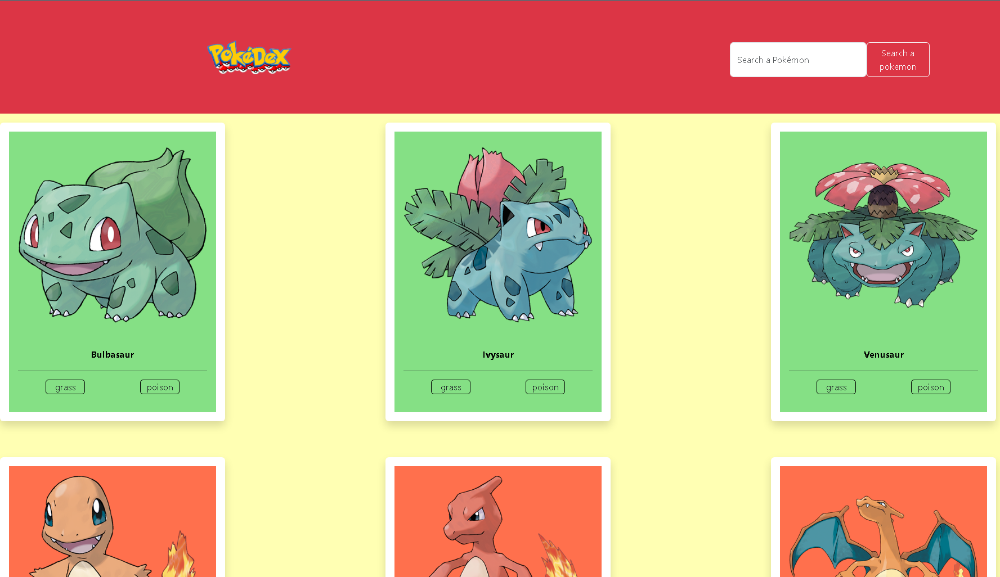
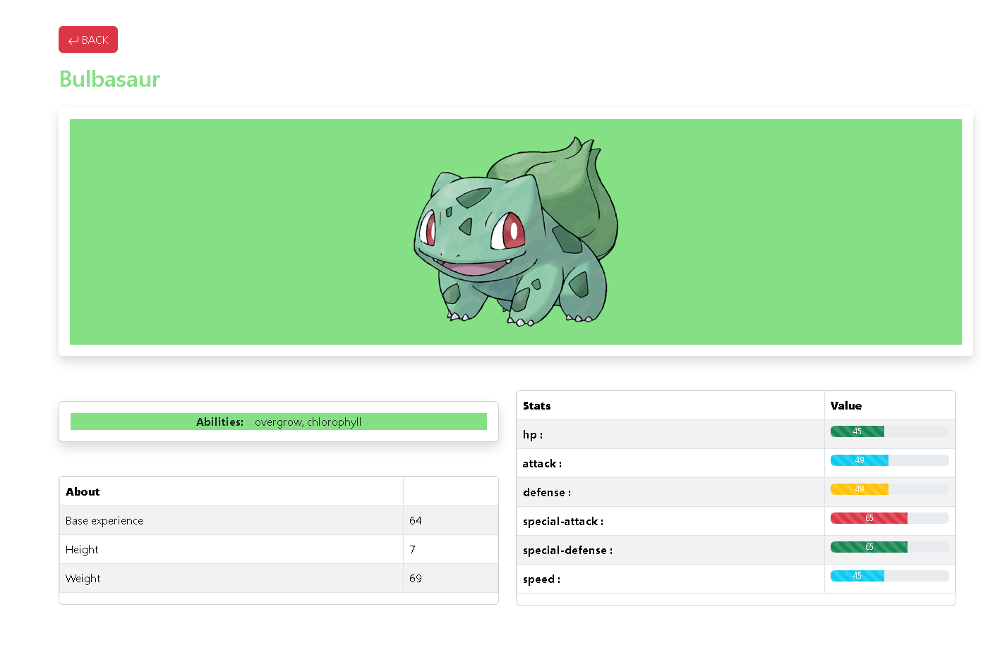

# Welcome to My Pokemon Ap



## Task
The task is to create a pokedex app. The pokedex app must render a home page that displays all pokemons and when clicked on a pokemon, it's details must be shown.

## Description
The app was created using React js and some dependecies. The app contains a folder Components. Inside it are all the different components that were used. an image file for all the images used on the site and a service page basically for the tash of searching a particular pokemon uainfg search page. The project implements Lazy Loading so as to reduce the delay cause by massive api call.

## Installation
The app is hosted online at <a href="https://dev.d26e7fay8j7tuf.amplifyapp.com/">Pokedex by Ouatedem</a>  To run the code locally. download the source code, run
```bash
npm install
```

Then
```bash
npm start
```

and go to set port in package.jsom file

## Usage
Go to <a href="https://dev.d26e7fay8j7tuf.amplifyapp.com/">Pokedex by Ouatedem</a> Scroll down the page to see all Pokemons. Click on a pokemon to see it's details. The app also contains a search bar. Enter a name of a pokemon and it will fetch it


### The Core Team


<span><i>Made at <a href='https://qwasar.io'>Qwasar SV -- Software Engineering School</a></i></span>
<span></span>
